import ReadingTime from '../../src/components/reading-time/reading-time';

# Fleet Management RestAPI

<ReadingTime/>
 

## Introduction

**The Fleet Management RestAPI**, is a powerful and flexible solution for optimizing and managing your fleet operations. This API is designed to streamline route planning, order fulfillment, and vehicle assignments by leveraging **Vehicle Routing Problem (VRP)** optimization. Whether you are managing deliveries, service operations, or logistics, our API provides all the tools you need to maximize efficiency and minimize costs.

## Feature list

**The Fleet Management RestAPI** is designed to handle a wide variety of logistics, routing, and optimization tasks, providing robust support for fleet operations. Below is an overview of the key features:

 ### 1. Customers and Orders
   - **Customer Management**:
     - Add, retrieve, update, and delete customer profiles.
     - Manage customer contact information, such as email, phone number, and address.
     - Associate custom data with customers for additional information.
   - **Order Management**:
     - Add, retrieve, update, and delete orders.
     - Support for order types: **Pickup** and **Delivery**.
     - Define order attributes:
       - Time windows (start and end times).
       - Priority levels: **Low** or **High**.
       - Parcel details: weight, volume and number of packages.
       - Customizable service times per order.
     - Sequence orders into specific routes or enforce delivery sequences.

### 2. Vehicles
   - **Vehicle Management**:
     - Add, retrieve, update, and delete vehicles.
     - Define vehicles by type: **Car**, **Truck**, **Bike**, **E-bike**, or **Pedestrian**.
     - Manage vehicle attributes:
       - Maximum load weight and volume.
       - Fuel type and consumption rates.
       - Physical dimensions: height, width, length, and axle load. (only for truck)
       - Operating costs (fixed and hourly).
     - Track vehicle availability and statuses (e.g., Available, En Route).
     - Assign vehicles to routes based on constraints and optimization results.
   - **Vehicle Constraints**:
     - Specify start and end times for vehicle operations.
     - Define maximum distance, number of orders, or packages for all vehicles or for each vehicle.
  
### 3. Territories
   - **Territory Management**:
     - Add, retrieve, update, and delete territories.
     - Define operational territories with different shapes: **Polygon**, **Circle**, or **Rectangle**.
     - Retrives orders inside territories, helps territory-based routing.
     - Customize territory colors for easier visualization.

### 4. Fleet Optimization
   - **Optimization Goals**:
     - Optimize routes based on distance or time.
   - **Route Types**:
     - Round routes (start and end at the same location).
     - End-anywhere routes (routes that end at the most efficient destination).
     - Custom endpoints for routes.
   - **Configuration Options**:
     - Set optimization quality: **Unoptimized**, **Fast**, **Optimized**, or **Best**.
     - Define matrix-building types for distance and time calculations:
       - User-defined or real-world driving metrics.
     - Specify road restrictions:
       - Avoid toll roads or highways "TBD".
   - **Fuel and Cost Efficiency**:
     - Incorporate fuel prices for multiple fuel types: Diesel Standard/Premium, Gasoline Standard/Premium, LPG, Electric.
     - Calculate route costs based on vehicle consumption and distance.
   - **Order Sequencing**:
     - Group orders into fixed or flexible sequences.
     - Enforce pickup and delivery pairings for specific use cases.
   - **Real-Time Operations**:
     - Reoptimize routes dynamically in response to changes.
     - Monitor vehicle progress, arrival times, and wait times.
   - **Custom Constraints**:
     - Allow dropped orders if no feasible solution is found.
     - Enable grouping of nearby orders for clustering efficiency.
     - Balance routes by time or the number of orders.

### 5. Reporting and Insights
   - **Performance Metrics**:
     - Total travel distance, duration, and service times per route.
     - Fuel consumption and cost estimations for each route.
     - Order-level details: delivery statuses, waiting times, and package counts.
   - **Export Options**:
     - Export routes in multiple formats, such as GPX or database files.

### 6. API Flexibility
   - **Async Operations**:
     - Perform asynchronous optimizations, order updates, and route reassignments.
   - **Error Handling**:
     - Detailed error messages and codes for debugging failed requests.
   - **Customization**:
     - Flexible configuration parameters to tailor optimizations to your business needs.

### 🚀 Step-by-Step Guide: Creating an Optimization

---

:::info 📌 **Order of Operations: Visual Flow**

```mermaid
graph LR
    A[👤 Customers] --> B[📦 Orders]
    B --> C[🚚 Vehicles]
    C --> D[⚙️ Optimization]
    D --> E[📊 Solution]
```

:::

---

### Step 1: Add Customers and Orders

Before optimizing routes, you need to define *who* is involved and *what* needs to be delivered or picked up.

#### 🧑‍💼 Create Customers

Customers are the people or organizations placing orders. Each order must be linked to a customer using their `customerId`.

* **API Endpoint:** `POST /customers`
* **Request:** An array of customer objects
* **Response:** Returns customer objects with system-generated `id`s

#### 📦 Create Orders

Orders define what is being delivered or picked up, and include location, time windows, priorities, and a `customerId`.

* **API Endpoint:** `POST /orders`
* **Request:** An array of order objects
* **Response:** Returns order objects with system-generated `id`s

---

### Step 2: Add Vehicles and Constraints

Vehicles represent your delivery or pickup fleet. Each vehicle can have specific limits or rules, known as constraints.

#### 🚚 Create Vehicles

Each vehicle will be used in route planning and must be created before optimization.

* **API Endpoint:** `POST /vehicles`
* **Request:** An array of vehicle objects
* **Response:** Returns vehicle objects with system-generated `id`s

#### 📏 Define Vehicle Constraints

These rules ensure routes stay within each vehicle’s capabilities, such as:

* Maximum capacity
* Maximum distance
* Revenue or delivery limitations

---

### Step 3: Set Optimization Parameters

Define settings that control how the optimization engine works. These can include:

* Optimization goals (e.g., minimize distance, time)
* Maximum search time
* Flexibility options

This step fine-tunes how the system balances different priorities.

---

### Step 4: Define Departures and Destinations

Set the start and end points for each vehicle’s route.

* **Departures:** Starting locations for vehicles. Affect travel time and routing logic.
* **Destinations:** Final stops for vehicles. Help ensure the most efficient route end-points.

These can be specific locations or rules (e.g., return to depot).

---

### Step 5: Create the Optimization

This is where everything comes together — customers, orders, vehicles, and parameters — to define the full routing problem.

* **API Endpoint:** `POST /optimizations`
* **Request:** An object that includes orders, vehicles, constraints, and optimization settings
* **Response:** Returns an `optimizationId` and `requestId` to track the process

---

### Step 6: Retrieve the Optimized Solution

Once the system has finished processing, fetch the optimized routes.

* **API Endpoint:** `GET /optimizations/{id}/solution`
* **Response:** A list of optimized routes for the fleet, based on the submitted data

---
