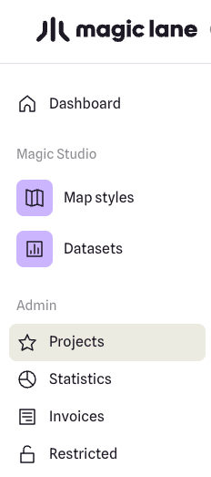

import ReadingTime from '../../src/components/reading-time/reading-time';

# Get Started

<ReadingTime/>
<br/><br/>

This section will guide you on how to interact with the **Fleet Management RestAPI** by explaining what an API request is, how to include an API key, and what a request looks like.

## What is an API Request?

An API request is how you interact with the Fleet Management API. It's a structured HTTP message that allows your application to retrieve or send data to the server. Each request typically consists of:

- **Endpoint URL**: The specific address of the resource you are interacting with, such as `/customers` or `/vehicles`.
- **HTTP Method**: The action you want to perform (e.g., GET, POST, PUT, DELETE).
- **Headers**: Information like your API key for authentication and content types.
- **Request Body (for POST/PUT)**: Data sent to the API in JSON format.

## How to Use an API Key

The Fleet Management API requires an API key to authenticate requests. Without it, the server will respond with a `401 Unauthorized` error. The API key is sent in the request headers as follows:

- **Header Name**: `Authorization`
- **Header Value**: `<Your_API_Key>`

## Example Request with API Key

Here's a simple example of a request to retrieve all customers:

### Request Details:

- **Endpoint**: `https://fleetmanagement.magiclaneapis.com/v1/customers`
- **Method**: `GET`
- **Headers**:
  - `Authorization: <Your_API_Key>`
  - `Content-Type: application/json`

### Request Example (cURL):

```sh
curl -X GET "https://fleetmanagement.magiclaneapis.com/v1/customers" \
-H "Authorization: YOUR_API_KEY" \
-H "Content-Type: application/json"  
```

## Authentication with API Key

Every Magic Lane SDK instance requires a unique API Key for authentication. Here's how to create an account, generate an API key, and integrate it into your requests.

:::danger[Warning]
Ensure that the API key remains secure and is not exposed. If the key is compromised or its integrity is uncertain, promptly revoke it and generate a new one to maintain security and prevent unauthorized usage that may incur additional costs.
:::

### Create your account

Go to the Magic Lane [registration/sign up page](https://developer.magiclane.com/api/login) to create a free account.

You only need to type in your email address and choose a new password. Optionally, you can also enter your name and company.\


Click the `Get started` button after reviewing the terms of service and privacy policy. You will get a confirmation email with a link to activate your account. After you activate your account by clicking on the link you received, you can sign in!


Go to the Magic Lane [login page](https://developer.magiclane.com/api/login) to sign in to your new account.
Type your complete email address, which you used to create the account, and the password you created when you signed up in the previous step.

## Create a project

Once logged in, you are on your [Dashboard](https://developer.magiclane.com/api/dashboard) page. Click the [Projects](https://developer.magiclane.com/api/projects) tab.



On the My Projects page, click the `Create project` button from the top-right side of the page.

A dialog appears, where you can type a name for the new project, and a short description.
When done, click `Create project`.


## Create an API Key

The project is created with an API key with a short expiration date.


Click `Generate additional API Key` to create another key for your project, where you can set an expiration date further into the future.


You can give the new API key a different name, and set any expiration date you want.
Click `Generate` to generate the API key.

:::danger[Warning]
Ensure that key management is properly planned and that the key on the client’s device is updated before its expiration date. Failure to do so will result in a watermark being displayed on the map and certain features becoming limited once the key has expired.
:::


You just created your first project and Magic Lane API Key!

You can click on the copy button to the right of the API Key to copy it, and then paste it in your code.